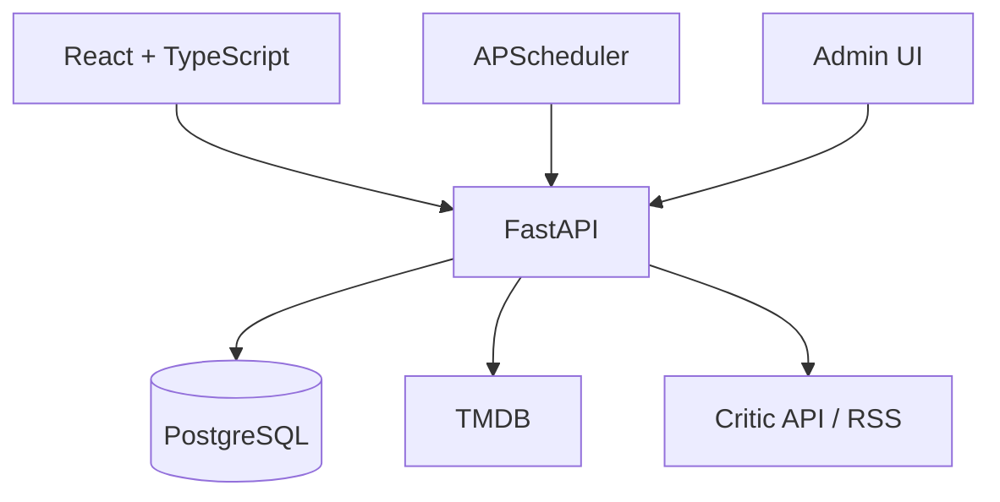

# Архитектура



Frontend обращается только к backend. Backend скрывает ключи внешних сервисов, нормализует ответы, сохраняет фильмы и применяет правила доступа.

## Структура

```text
backend/
  app/
  migrations/
  tests/
  requirements.txt
  .env.example
frontend/
  src/
  public/
  package.json
docs/
docker-compose.yml
README.md
.gitignore
```

## Технологии

- Backend: Python 3.13, FastAPI, SQLAlchemy 2, Alembic, Pydantic, HTTPX, APScheduler, pytest.
- Frontend: React, TypeScript, Vite, React Router, Axios, Context API, CSS Modules или CSS.
- Данные: PostgreSQL; локальный запуск допускает Docker Compose.

## Модули

`auth`, `users`, `movies`, `lists`, `ratings`, `reviews`, `friendships`, `critic_reviews`, `admin`.

