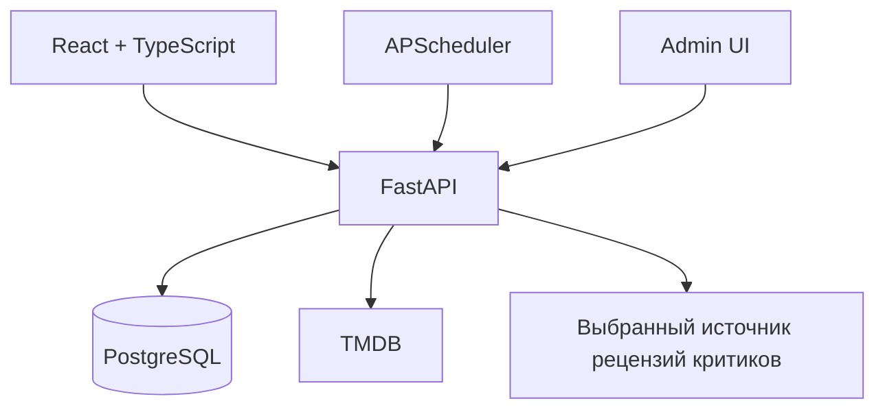

# Архитектура


```mermaid
flowchart TD
    A[React + TypeScript] --> B[FastAPI]
    B --> C[(PostgreSQL)]
    B --> D[TMDB]
    B --> E[Выбранный источник рецензий критиков]
    F[APScheduler] --> B
    G[Admin UI] --> B
```

Клиентская часть обращается только к серверной части. Сервер скрывает ключи внешних служб, нормализует их ответы, сохраняет данные и проверяет права доступа. TMDB используется для каталога фильмов. Автоматический источник рецензий критиков ещё предстоит выбрать; до этого его адрес и формат данных нельзя считать заданными.

Внешние адреса и секретные ключи задаются в настройках окружения сервера. Не следует закреплять IP-адреса служб в приложении: поставщики могут менять адреса и использовать сети доставки содержимого.

При локальном запуске сервисы внутри Docker Compose связываются по именам служб; PostgreSQL использует внутренний порт `5432` и не должен открываться для внешних подключений. Браузер обращается к адресу backend, заданному в настройках клиентской части. Для TMDB серверу нужно исходящее HTTPS-соединение (порт `443`). Точный адрес backend и опубликованные локальные порты зависят от конфигурации запуска.

## Структура

```text
backend/
  app/
  migrations/
  tests/
  requirements.txt
  .env.example
frontend/
  src/
  public/
  package.json
docs/
docker-compose.yml
README.md
.gitignore
```

## Технологии

- Backend: Python 3.13, FastAPI, SQLAlchemy 2, Alembic, Pydantic, HTTPX, APScheduler, pytest.
- Frontend: React, TypeScript, Vite, React Router, Axios, Context API, CSS Modules или CSS.
- Данные: PostgreSQL; локальный запуск допускает Docker Compose.

## Модули

`auth`, `users`, `movies`, `lists`, `ratings`, `reviews`, `friendships`, `critic_reviews`, `admin`.
